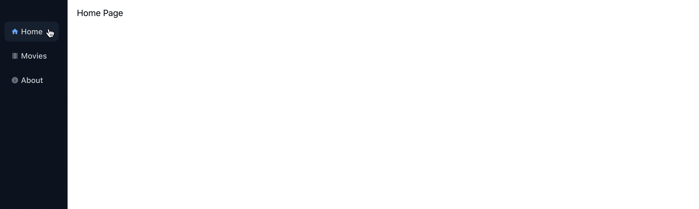

# React NFT

React No Framework Toolkit (NFT) is a step-by-step guide to build a React app from scratch.

## Features

The guide provides the following features:

**Core**
* Bootstrapping with [create-react-app].
* Utility-first CSS framework with [tailwindcss].
* UI component explorer with [storybook].
* Hooks for fetching, caching and updating with [react-query].

**Extra**
* Page navigation with [react-router].
* React hooks with [react-use].
* Promise based HTTP client with [axios].
* Icons with [react-icons].
* Resizable Pane with [react-split-pane].
* Tooltips with [react-tooltip].
* Keyboard shortcuts with [mousetrap].
* API mocking library with [miragejs].

[create-react-app]: https://github.com/facebook/create-react-app
[tailwindcss]: https://tailwindcss.com
[storybook]: https://storybook.js.org
[react-query]: https://react-query.tanstack.com
[react-router]: https://reactrouter.com/web/guides/quick-start
[react-use]: https://streamich.github.io/react-use
[axios]: https://github.com/axios/axios
[react-icons]: https://react-icons.github.io/react-icons
[react-split-pane]: https://github.com/tomkp/react-split-pane
[react-tooltip]: https://github.com/wwayne/react-tooltip
[mousetrap]: https://github.com/ccampbell/mousetrap
[miragejs]: https://miragejs.com/

## How to Use

The repo contains the final result of the app, but also the documentation to build it from scratch.

* If you're interested in learning, the recommended way is to follow the documentation and build your new app from scratch.
* If you're interested in using the repo as a starter you can simply clone it, execute `yarn start` and start developing.

## Structure

The guide is separated in chapters and each chapter contains various steps.

### Chapter 1

During this chapter we setup the `react` app, install [tailwindcss], configure page navigation and prepare a side menu with tooltips and keyboard shortcuts. Once finished we prepare an `ARCHITECTURE.md` that describes in high-level the system.

1. [Setup React App](doc/chapter-1/1.setup-react-app.md)
2. [Setup TailwindCSS](doc/chapter-1/2.setup-tailwindcss.md)
3. [Add Page Navigation](doc/chapter-1/3.add-page-navigation.md)
4. [Prevent Overscrolling](doc/chapter-1/4.prevent-overscrolling.md)
5. [Add SideMenu](doc/chapter-1/5.add-sidemenu.md)
6. [Add SideMenu Tooltips](doc/chapter-1/6.add-sidemenu-tooltips.md)
7. [Add SideMenu Keyboard Shortcuts](doc/chapter-1/7.add-sidemenu-keyboard-shortcuts.md)
8. [Add Architecture](doc/chapter-1/8.add-architecture.md)

### Chapter 2

On chapter 2 we focus on visual components. We build the UI bottom-up starting with basic components then progressively combined to assemble screens, following [component-driven] development.

We'll install storybook and build UIs for buttons, headers, cards, tables, pages, form fields and a confirmation modal.

[component-driven]: https://www.componentdriven.org/

1. [Add Storybook](doc/chapter-2/1.add-storybook.md)
2. [Add UI Buttons](doc/chapter-2/2.add-ui-buttons.md)
3. [Add UI Header](doc/chapter-2/3.add-ui-header.md)
4. [Add UI Card](doc/chapter-2/4.add-ui-card.md)
5. [Add UI Table](doc/chapter-2/5.add-ui-table.md)
6. [Add UI Page](doc/chapter-2/6.add-ui-page.md)
7. [Add UI Form Fields](doc/chapter-2/7.add-ui-form-fields.md)
8. [Add UI Confirmation Modal](doc/chapter-2/8.add-ui-confirmation-modal.md)

### Chapter 3

On chapter 3 we implement a full CRUDL for a model, as an example we use `movies`.

* We'll setup [Suspense] for loading and error states. We install [react-query] to handle fetch, cache and update data using hooks. We install [miragejs] to mock API calls on the browser.
* Next, we define the Movies model, the movies API actions and the movies hooks used in the pages.
* Lastly, we define each of the pages of CRUDL (Create, Read, Update, List).

[Suspense]: https://reactjs.org/docs/concurrent-mode-suspense.html

1. [Add Suspense Container](doc/chapter-3/1.add-suspense-container.md)
2. [Add QueryClientProvider](doc/chapter-3/2.add-query-client-provider.md)
3. [Add MirageJS](doc/chapter-3/3.add-miragejs.md)
4. [Add Movies Model](doc/chapter-3/4.add-movies-model.md)
5. [Add Movies Actions](doc/chapter-3/5.add-movies-actions.md)
6. [Add Movies Store](doc/chapter-3/6.add-movies-store.md)
7. [Add List Movies](doc/chapter-3/7.add-list-movies.md)
8. [Add Create Movie](doc/chapter-3/8.add-create-movie.md)
9. [Add View Movie](doc/chapter-3/9.add-view-movie.md)
10. [Add Edit Movie](doc/chapter-3/10.add-edit-movie.md)
11. [Add Movies Pages](doc/chapter-3/11.add-movies-pages.md)
