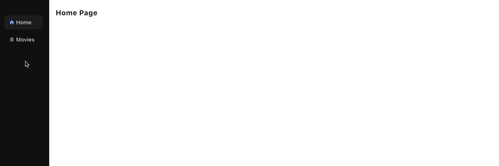

# Add SideMenu

* Time:  5'
* Rating: ⭐⭐⭐⭐

Add SideMenu with icons, active and hoverable states and persisted sizeable pane:



## The components

For the above SideMenu we use the following components:

- react-icons: The Icons.
- react-split-pane: The Resizable Split Pane.
- react-use: The hook for persistence using localStorage.

```bash
yarn add react-icons react-use react-split-pane
```

## The Code

Add `src/ui/layouts/SideMenu.tsx`

```tsx
import React from 'react';
import { MdHome, MdInfo, MdLocalMovies } from 'react-icons/md';
import { NavLink } from 'react-router-dom';
import SplitPane from 'react-split-pane';
import { useLocalStorage } from 'react-use';

interface SideMenuProps { children: any }
export default function SideMenu({ children }: SideMenuProps) {
  const [value, setValue] = useLocalStorage('sidemenu.size', 200);
  return (
    <div className="flex z-30 h-full">
      <SplitPane onDragFinished={setValue} split="vertical" minSize={130} defaultSize={value} maxSize={400}>
        <Menu />
        <div className="z-10 p-4 overflow-auto h-full">
          {children}
        </div>
      </SplitPane>
    </div>
  )
}

// Menu at the top with navigation buttons
function Menu() {
  return (
    <nav className="bg-gray-900 w-full flex flex-col h-full pt-10 text-gray-500">
      <NavButton icon={<MdHome className="text-current" />} exact to='/' title="Home" />
      <NavButton icon={<MdLocalMovies className="text-current" />} exact to='/movies' title="Movies" />
      <NavButton icon={<MdInfo className="text-current" />} to='/about' title="About" />
    </nav>
  )
}

// navigation button on menu
interface NavButtonProps { to: string, title: string, description?: string, shortcut?: string, exact?: boolean, icon?: any }
function NavButton({ exact = false, to, title, description, shortcut, icon }: NavButtonProps) {
  return <div>
    <NavLink data-tip data-for={title} activeClassName="text-blue-400  bg-gray-800" exact={exact} to={to} className="
  my-1 mx-4 px-3 py-2 rounded-lg text-sm font-medium
 hover:bg-gray-800 flex items-center
  focus:outline-none space-x-1
">{icon}<span className="text-gray-300">{title}</span></NavLink>
  </div>
}
```

React Split Pane needs some CSS to be included on `src/App.css`:

```css
.Resizer {
  background: #000;
  opacity: 0.2;
  z-index: 1;
  -moz-box-sizing: border-box;
  -webkit-box-sizing: border-box;
  box-sizing: border-box;
  -moz-background-clip: padding;
  -webkit-background-clip: padding;
  background-clip: padding-box;
}

.Resizer:hover {
  -webkit-transition: all 2s ease;
  transition: all 2s ease;
}

.Resizer.horizontal {
  height: 11px;
  margin: -5px 0;
  border-top: 5px solid rgba(255, 255, 255, 0);
  border-bottom: 5px solid rgba(255, 255, 255, 0);
  cursor: row-resize;
  width: 100%;
}

.Resizer.horizontal:hover {
  border-top: 5px solid rgba(0, 0, 0, 0.5);
  border-bottom: 5px solid rgba(0, 0, 0, 0.5);
}

.Resizer.vertical {
  width: 11px;
  margin: 0 -5px;
  border-left: 5px solid rgba(255, 255, 255, 0);
  border-right: 5px solid rgba(255, 255, 255, 0);
  cursor: col-resize;
}

.Resizer.vertical:hover {
  border-left: 5px solid rgba(0, 0, 0, 0.5);
  border-right: 5px solid rgba(0, 0, 0, 0.5);
}
.Resizer.disabled {
  cursor: not-allowed;
}
.Resizer.disabled:hover {
  border-color: transparent;
}
```

## The App

Connect SideMenuLayout to `App.tsx`:

```diff
import React from 'react';
import {
  BrowserRouter as Router, Route, Switch
} from "react-router-dom";
import './App.css';
+import SideMenu from './layouts/SideMenu';
import About from './pages/About';
import Home from './pages/Home';

function App() {
  return (
    <Router>
+      <SideMenu>
      <Switch>
				<Route exact path="/"><Home /></Route>
        <Route exact path="/about"><About /></Route>
      </Switch>
+      </SideMenu>
    </Router>
  )
}

export default App;
```

**Next**: [Add SideMenu Tooltips](6.add-sidemenu-tooltips.md)
