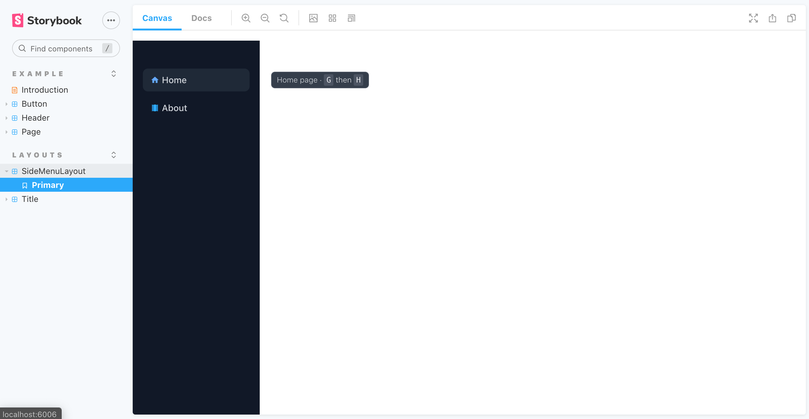

# Add Storybook

[Storybook](https://storybook.js.org/) is an open source tool for developing UI components in isolation for React.



## Init Storybook

Initialization of storybook depends on the starter project:

```tsx
npx sb init
```

## Start Storybook

Now we can start the storybook with:

```tsx
> yarn storybook
╭───────────────────────────────────────────────────╮
│                                                   │
│   Storybook 6.1.21 started                        │
│   15 s for preview                                │
│                                                   │
│    Local:            http://localhost:6006/       │
│    On your network:  http://192.168.0.13:6006/    │
│                                                   │
╰───────────────────────────────────────────────────╯
```

## Use Storybook

Create `src/ui/layouts/SideMenu.stories.tsx`:

```tsx
// also exported from '@storybook/react' if you can deal with breaking changes in 6.1
import { Meta, Story } from '@storybook/react/types-6-0';
import React from 'react';
import SideMenu from './SideMenu';

export default {
  title: 'Layouts/SideMenu',
  component: SideMenu,
  argTypes: {
  },
} as Meta;

const Template: Story = (args) => <SideMenu {...args}>{ }</SideMenu>;

export const Primary = Template.bind({});
Primary.args = {
};
```

We get the following error:

```tsx
Invariant failed: You should not use <NavLink> outside a <Router>
```

In order to resolve this we need a Router to be injected on Storybooks, let's add this as decorator globally, create `/.storybook/Layout.tsx`

```tsx
import React from 'react';
import { MemoryRouter } from 'react-router-dom';
import '../src/index.css';
import '../src/App.css';

const Layout = ({ children }) => {
  return (
    <MemoryRouter>
      {children}
    </MemoryRouter>
  )
}

export default Layout;
```

And inject it on `/.storybook/preview.js`:

```diff
+ import { addDecorator } from '@storybook/react';
+ import React from 'react';
+ import Layout from './Layout';
+ 
+ addDecorator(storyFn => <Layout>{storyFn()}</Layout>);

export const parameters = {
  actions: { argTypesRegex: "^on[A-Z].*" },
}
```

Now we need to storybook to run postcss and autoprefixer to get the tailwind styles baked in. Update `.storybook/main.js` with:

```tsx
const path = require('path')

module.exports = {
  "stories": [
    "../src/**/*.stories.mdx",
    "../src/**/*.stories.@(js|jsx|ts|tsx)"
  ],
  "addons": [
    "@storybook/addon-links",
    "@storybook/addon-essentials",
    "@storybook/preset-create-react-app"
  ],
  webpackFinal: async (config) => {
    config.module.rules.push({
      test: /\,css&/,
      use: [
        {
          loader: 'postcss-loader',
          options: {
            ident: 'postcss',
            plugins: [
              require('tailwindcss'),
              require('autoprefixer')
            ]
          }
        }
      ],
      include: path.resolve(__dirname, '../'),
    })
    return config
  }
}
```

**Next**: [Add UI Buttons](2.add-ui-buttons.md)
