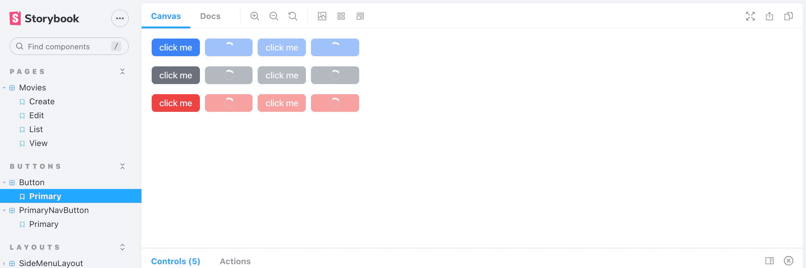

# Add UI Buttons



## Button

Button is used to perform actions, it has three types: primary, secondary and danger. It received a button text and a function. Button can be disabled, and when action is performed, it is showing a spinner instead of text until action is finished.

## Dependencies

We use react-icons, if you don't have it installed already do:

```bash
> yarn add react-icons
```

## Code

Code is at `src/ui/buttons/Button.tsx`:

```tsx
import React, { useMemo, useState } from 'react';
import { CgSpinner } from 'react-icons/cg';
import ReactTooltip from 'react-tooltip';
import useMousetrap from '../../hooks/use-mousetrap';

export interface ButtonProps {
  loading?: boolean,
  disabled?: boolean,
  text: any,
  autofocus?: boolean,
  type?: "primary" | "secondary" | "danger" | "basic",
  description?: string,
  /**
   * Shortcut key.
   */
   shortcut?: string,
   onClick?(): void
}
export default function Button({ loading = false, disabled = false, text, autofocus = false, type = "primary", description, shortcut, onClick }: ButtonProps) {
  const typeClass = useMemo(() => {
    switch (type) {
      case "danger": return "bg-red-500 text-white active:bg-red-500 hover:bg-red-600 hover:text-white focus:ring-red-300"
      case "secondary": return "bg-gray-500 text-white active:bg-gray-500 hover:bg-gray-600 hover:text-white focus:ring-gray-300"
      case "basic": return "text-gray-500 active:text-black hover:text-black focus:ring-gray-300"
      default: return "bg-blue-500 text-white active:bg-blue-500 hover:bg-blue-600 hover:text-white focus:ring-blue-300"
    }
  }, [type])
  const [currentLoading, updateLoading] = useState(loading)

  const click = async () => {
    updateLoading(true)
    onClick && await onClick()
    updateLoading(false)
  }

  useMousetrap(shortcut?.toLowerCase() || "", click);

  return <button data-tip data-for={text}
    className={`relative items-center ${typeClass}
      px-3 py-1 rounded-md font-medium text-sm tracking-tight 
      focus:outline-none focus:ring disabled:opacity-50`}
    autoFocus={autofocus}
    disabled={loading || disabled}
    type="submit"
    name="action"
    onClick={click}
    value="submit">
    {currentLoading && <div className="absolute inset-1/2 -mt-2.5 -mx-2.5"><CgSpinner className="icon-spin" size={20} /></div>}
    <span className={`${loading && 'opacity-0'}`}>
      {text}&#8203;
    </span>
    {description && <ReactTooltip id={text} className="tooltip" place="bottom" effect="solid" delayShow={400} border={false} backgroundColor="transparent">
      <div className="bg-gray-800 p-1 border rounded-md border-gray-700 px-2 text-xs text-gray-300 font-light">
        {description}
        {shortcut && <span className="text-xs text-gray-200">&nbsp;&nbsp;&nbsp;&nbsp;<code className="bg-gray-700 inset-0 px-1 py-0.5 rounded-sm text-xs">{shortcut}</code></span>}
      </div>
    </ReactTooltip>
    }
  </button>
}
```

In order to get spinning icon let's add the following on `src/App.css`:

```css
.icon-spin {
  -webkit-animation: icon-spin 1s infinite linear;
          animation: icon-spin 1s infinite linear;
}

@-webkit-keyframes icon-spin {
  0% {
    -webkit-transform: rotate(0deg);
            transform: rotate(0deg);
  }
  100% {
    -webkit-transform: rotate(359deg);
            transform: rotate(359deg);
  }
}

@keyframes icon-spin {
  0% {
    -webkit-transform: rotate(0deg);
            transform: rotate(0deg);
  }
  100% {
    -webkit-transform: rotate(359deg);
            transform: rotate(359deg);
  }
}
```

And to get the `active` and `disabled` tailwind classes we need to activate them explicitly on `tailwind.config.js`:

```diff
variants: {
    extend: {
+      backgroundColor: ['active'],
+      opacity: ['disabled'],
    }
  },
```

## Stories

Stories is at `src/ui/buttons/Button.stories.tsx`:

```tsx
// also exported from '@storybook/react' if you can deal with breaking changes in 6.1
import { Meta, Story } from '@storybook/react/types-6-0';
import React from 'react';
import Button, { ButtonProps } from './Button';

export default {
  title: 'Buttons/Button',
  component: Button,
  argTypes: {
  },
} as Meta;

const Template: Story<ButtonProps> = (args: ButtonProps) => <div className="space-y-4">
  <Row {...args} type="primary"/>
  <Row {...args} type="secondary"/>
  <Row {...args} type="danger"/>
  <Row {...args} type="basic"/>
</div>

function Row(args: ButtonProps) {
  return <div className="space-x-2">
    <Button {...args} />
    <Button {...args} loading={true} />
    <Button {...args} loading={false} disabled={true} />
    <Button {...args} loading={true} disabled={true} />
  </div>
}
export const Primary = Template.bind({});
Primary.args = {
  text: "click me",
  description: "This button does stuff",
  shortcut: "C"
};
```

## Link

Link are very similar to Button but instead of an action, it redirects to a different page.

### Code

Code is at `src/ui/buttons/Link.tsx`:

```tsx
// src/ui/buttons/Link.tsx

import React, { useMemo } from 'react';
import { NavLink } from 'react-router-dom';
import ReactTooltip from 'react-tooltip';
import useMousetrap from '../../hooks/use-mousetrap';
import { useHistory } from 'react-router-dom';

export interface LinkProps {
  /**
   * Button content (Can be text or icon).
   */
  children: any

  /**
   * Click redirects to page.
   */
  to: string,

  /**
   * Description of Link displayed as tooltip.
   */
  description?: string,

  /**
   * Shortcut key.
   */
  shortcut?: string,
  type?: "primary" | "secondary" | "danger" | "basic",
}

function Link({ to, children, description, shortcut, type = "primary" }: LinkProps) {
  const typeClass = useMemo(() => {
    switch (type) {
      case "danger": return "bg-red-500 text-white active:bg-red-500 hover:bg-red-600 hover:text-white focus:ring-red-300"
      case "secondary": return "bg-gray-500 text-white active:bg-gray-500 hover:bg-gray-600 hover:text-white focus:ring-gray-300"
      case "basic": return "text-gray-500 active:text-black hover:text-black focus:ring-gray-300"
      default: return "bg-blue-500 text-white active:bg-blue-500 hover:bg-blue-600 hover:text-white focus:ring-blue-300"
    }
  }, [type])

  const history = useHistory()
  useMousetrap(shortcut?.toLowerCase() || "", () => history.push(to));

  return (
    <NavLink data-tip data-for={to} to={to} className="focus:outline-none"><button type="button" className={`h-7 relative items-center ${typeClass}
    px-3 py-1 rounded-md font-medium text-sm tracking-tight 
    focus:outline-none focus:ring disabled:opacity-50`}
    >{children}</button>
      {description && <ReactTooltip id={to} multiline={false} className="tooltip" place="bottom" effect="solid" delayShow={400} border={false} backgroundColor="transparent">
        <div className="bg-gray-800 p-1 border rounded-md border-gray-700 px-2 text-xs text-gray-300 font-light">
          {description}
          {shortcut && <span className="text-xs text-gray-200">&nbsp;&nbsp;&nbsp;&nbsp;<code className="bg-gray-700 inset-0 px-1 py-0.5 rounded-sm text-xs">{shortcut}</code></span>}
        </div>
      </ReactTooltip>
      }
    </NavLink>
  );
}

export default Link
```

### Story

Story is at `ui/buttons/Link.stories.tsx`:

```tsx
// src/ui/buttons/Link.stories.tsx

// also exported from '@storybook/react' if you can deal with breaking changes in 6.1
import { Meta, Story } from '@storybook/react/types-6-0';
import React from 'react';
import Link, { LinkProps } from './Link';
import { BiEdit } from 'react-icons/bi';

export default {
  title: 'Buttons/Link',
  component: Link,
  argTypes: {
  },
} as Meta;

const Template: Story<LinkProps> = (args: LinkProps) => <div className="space-y-4">
  <Row {...args} type="primary"/>
  <Row {...args} type="secondary"/>
  <Row {...args} type="danger"/>
  <Row {...args} type="basic"/>
</div>

function Row(args: LinkProps) {
  return <div className="space-x-2">
    <Link {...args} />
  </div>
}
export const Primary = Template.bind({});
Primary.args = {
  children: "click me",
  to: "/abc",
  description: "This button does stuff",
  shortcut: "C",
};

export const Icon = Template.bind({});
Icon.args = {
  children: <BiEdit/>,
  to: "/abc",
  description: "This button does stuff",
  shortcut: "C",
};
```

**Next**: [Add UI Header](3.add-ui-header.md)
