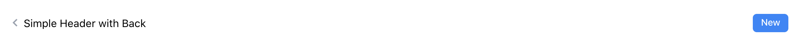

# Add UI Header



## Header

Header is used on top side to display the header of the current page. It can optionally include an action button at the right side and a back icon at the left side.

## Dependencies

It uses `react-icons`:

```tsx
yarn add react-icons
```

### Code

`/src/ui/typography/Header`:

```tsx
// src/ui/typography/Header.tsx

import React from 'react'
import { BiChevronLeft } from 'react-icons/bi'
import { NavLink } from 'react-router-dom'

export interface HeaderProps {
  text: string,
  back?: string,
  children?: any
}

function Header({ text, back, children }: HeaderProps) {
  return (
    <div>
      <div className="flex items-center h-8">
        {back !== undefined && <NavLink to={back}>
          <BiChevronLeft className="text-4xl text-gray-400 hover:text-black" />
        </NavLink>}
        <h1 className="flex-grow">{text}</h1>
        <div className="flex space-x-1">{children}</div>
      </div >
    </div>
  )
}

export default Header
```

### Stories

Stories is located at `src/ui/typography/Header.stories.tsx`:

```tsx
// src/ui/typography/Header.stories.tsx

// also exported from '@storybook/react' if you can deal with breaking changes in 6.1
import { Meta, Story } from '@storybook/react/types-6-0';
import React from 'react';
import { BiEdit } from 'react-icons/bi';
import Button from '../buttons/Button';
import Link from '../buttons/Link';
import Header from './Header';

export default {
  title: 'Layouts/Header',
  component: Header,
  argTypes: {
  },
} as Meta;

export const Simple: Story = () => <Header text="Simple Header" />

export const WithButton: Story = () => <Header text="Simple Header with Button">
  <Button text="New" />
</Header>

export const WithBack: Story = () => <Header back="/" text="Simple Header with Back">
  <Link to="/"><BiEdit/></Link>
</Header>
```

**Next**: [Add UI Card](4.add-ui-card.md)