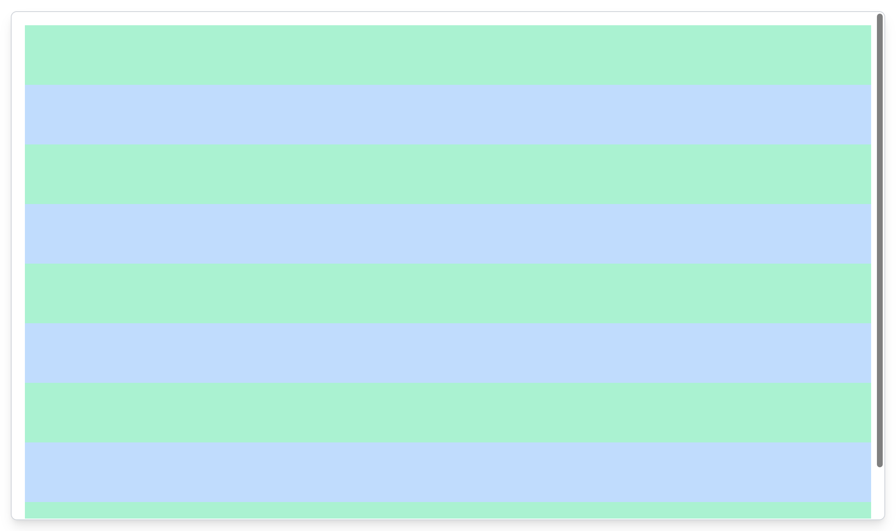

# Add UI Card



## Card

Add `src/ui/cards/Card.tsx`:

```tsx
// src/ui/cards/Card.tsx

import React from 'react'

export interface Props { children: any }
function Card({ children }: Props) {
  return (
    <div className="flex-grow flex flex-col h-full w-full p-4 border-2 rounded-lg shadow-lg border-gray-300 overflow-y-auto">
      {children}
    </div>
  )
}

export default Card
```

Add to `src/App.css` so that the page is always stretched to full height:

```tsx
#root {
  height: 100%;
}
```

## Stories

Add `src/ui/cards/Card.stories.tsx`:

```tsx
// src/ui/cards/Card.stories.tsx

// also exported from '@storybook/react' if you can deal with breaking changes in 6.1
import { Meta, Story } from '@storybook/react/types-6-0';
import React from 'react';
import Card from './Card';

export default {
  title: 'Cards/Card',
  component: Card,
  argTypes: {
  },
} as Meta;

export const Primary: Story = () => <Card>
  <div className="w-full h-full bg-green-200" />
</Card>

export const VerticalScroll: Story = () => <Card>
  <div className="w-full py-10 bg-green-200" />
  <div className="w-full py-10 bg-blue-200" />
  <div className="w-full py-10 bg-green-200" />
  <div className="w-full py-10 bg-blue-200" />
  <div className="w-full py-10 bg-green-200" />
  <div className="w-full py-10 bg-blue-200" />
  <div className="w-full py-10 bg-green-200" />
  <div className="w-full py-10 bg-blue-200" />
  <div className="w-full py-10 bg-green-200" />
</Card>
```

**Next**: [Add UI Table](5.add-ui-table.md)
