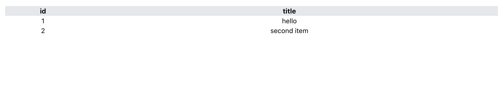

# Add UI Table



## Code

Add `src/ui/cards/Table.tsx`:

```tsx
// src/ui/cards/Table.tsx

import React from 'react'
import { useHistory } from 'react-router-dom'

export interface Props { columns: string[], items: any[], to: string }
function Table({ columns, items, to }: Props) {
  const history = useHistory()
  const viewItem = (id: number) => {
    history.push(`${to}/${id}`)
  }

  return (
    <table className="rounded-t-md bg-gray-200 table text-left w-full">
      <thead className="table-header-group col-span-full w-full">
        <tr className="text-left">
          {columns.map(col => <th className="px-2" key={col}>{col}</th>)}
        </tr>
      </thead>
      <tbody className="bg-white">
        {items && items.map((item: any) => (
          <tr className="cursor-pointer hover:bg-gray-100" key={item.id} onClick={() => viewItem(item.id)}>
            {columns.map((column: string) => (
              <td className="px-2">{item[column]}</td>
            ))}
          </tr>
        ))}
      </tbody>
    </table>
  )
}

export default Table
```

## Stories

Add `src/ui/cards/Table.stories.tsx`:

```tsx
// src/ui/cards/Table.stories.tsx

// also exported from '@storybook/react' if you can deal with breaking changes in 6.1
import { Meta, Story } from '@storybook/react/types-6-0';
import React from 'react';
import Table, { Props } from './Table';

export default {
  title: 'Cards/Table',
  component: Table,
  argTypes: {
  },
} as Meta;

const Template: Story<Props> = (args: Props) => <Table {...args} />

export const Primary = Template.bind({});
Primary.args = {
  to: "/movies/view",
  columns: ["id", "title"],
  items: [
    { id: 1, title: "hello" },
    { id: 2, title: "second item" }
  ]
};
```

**Next**: [Add UI Page](6.add-ui-page.md)
