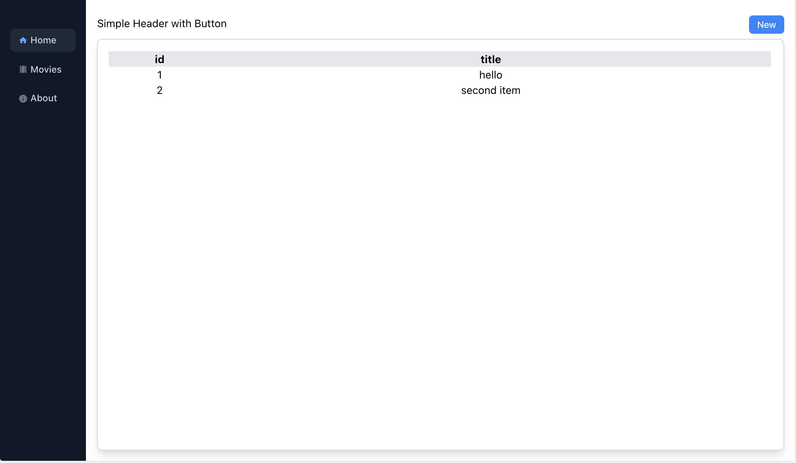

# Add UI Page



## Description

Page is the binding component of each Page. As example we have the binding of Menu on the left side, Header on top with a Button and a Card with a Table on the main screen.

## Code

Add `src/ui/cards/Page.tsx`:

```tsx
import React from 'react'

export interface Props { children: any }
function Page({ children }: Props) {
  return (
    <div className="flex flex-col space-y-4 h-full">
        {children}
    </div>
  )
}

export default Page
```

## Stories

Add `src/ui/cards/Page.stories.tsx`:

```tsx
// also exported from '@storybook/react' if you can deal with breaking changes in 6.1
import { Meta, Story } from '@storybook/react/types-6-0';
import React from 'react';
import SideMenu from '../layouts/SideMenu';
import Button from '../buttons/Button';
import Header from '../typography/Header';
import Card from './Card';
import Page from './Page';
import Table from './Table';

export default {
  title: 'Cards/Page',
  component: Card,
  argTypes: {
  },
} as Meta;

export const Primary: Story = () => <Page>
  <Header text="Simple Header with Button">
    <Button text="New" />
  </Header>
  <Card>
    <div className="w-full h-full bg-green-200" />
  </Card>
</Page>

export const WithMenu: Story = () => <SideMenu>
  <Page>
    <Header text="Simple Header with Button">
      <Button text="New" />
    </Header>
    <Card>
      <div className="w-full py-10 bg-green-200" />
      <div className="w-full py-10 bg-blue-200" />
      <div className="w-full py-10 bg-green-200" />
      <div className="w-full py-10 bg-blue-200" />
      <div className="w-full py-10 bg-green-200" />
      <div className="w-full py-10 bg-blue-200" />
      <div className="w-full py-10 bg-green-200" />
      <div className="w-full py-10 bg-blue-200" />
      <div className="w-full py-10 bg-green-200" />
    </Card>
  </Page>
</SideMenu>

export const WithTable: Story = () => <SideMenu>
  <Page>
    <Header text="Simple Header with Button">
      <Button text="New" />
    </Header>
    <Card>
      <Table to="/movies/view"
        columns={["id", "title"]}
        items={[
          { id: 1, title: "hello" },
          { id: 2, title: "second item" }
        ]}
      />
    </Card>
  </Page>
</SideMenu>
```

## Home Page

Update `src/pages/Home.tsx`:

```tsx
// src/pages/Home.tsx

import React from 'react';
import Page from '../ui/cards/Page';
import Header from '../ui/typography/Header';

export default function Home() {
  return (
    <Page>
      <Header text="Home Page" />
    </Page>
  );
}
```

## About Page

Update `src/pages/About.tsx`:

```tsx
// src/pages/About.tsx

import React from 'react';
import Page from '../ui/cards/Page';
import Header from '../ui/typography/Header';

export default function Home() {
  return (
    <Page>
      <Header text="About" />
    </Page>
  );
}
```

**Next**: [Add UI Form Fields](7.add-ui-form-fields.md)
